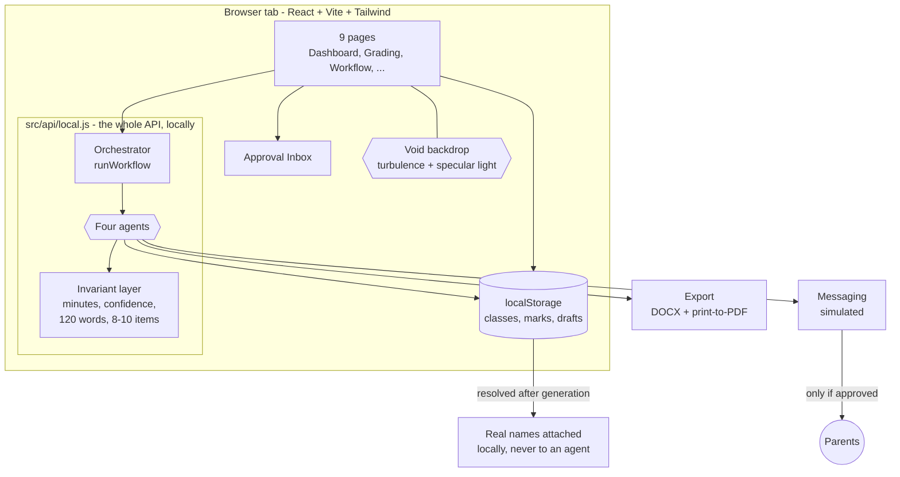

<div align="center">

# 🎓 TeacherCopilot

### *An agentic AI teaching assistant that takes the admin off a teacher's plate.*

**Built for school teachers (SDG 4: Quality Education) | Classes 6–12 | English + Hindi**

[](https://jyotitiwari250657.github.io/Teacher-Copilot/)
[](https://github.com/jyotitiwari250657/Teacher-Copilot)


</div>

---

A teacher opens one page, presses **Run Weekly Workflow**, and four specialised AI agents plan the lesson, build three levels of differentiated material, grade every script, regroup the class from the real marks, and draft a message for every family.

The teacher reviews and approves everything.

> **🛡️ Nothing is ever sent to a parent without a click.**

> **🌐 The whole app runs in your browser.** There is no backend server, no database, no API key, and no Python required for the UI. Clone it, run one command, and it works offline. Your student data never leaves the machine.

---

## 📑 Table of Contents

1. [What it does](#-what-it-does)
2. [Architecture](#-architecture)
3. [Quick Start](#-quick-start)
4. [Why there is no backend](#-why-there-is-no-backend)
5. [The 3-Minute Demo](#-the-3-minute-demo)
6. [Agent Behaviors](#-agent-behaviors)
7. [Safety & Privacy](#-safety--privacy)
8. [The In-Browser API](#-the-in-browser-api)
9. [Project Layout](#-project-layout)
10. [Testing](#-testing)
11. [Limitations](#-limitations)
12. [Future Scope](#-future-scope)
13. [Contributing](#-contributing)
14. [License](#-license)

---

## 🌟 What it does

TeacherCopilot automates the heavy lifting of classroom administration through a suite of specialist AI agents:

| Agent | What it does | Output |
| :--- | :--- | :--- |
| 📅 **Lesson Planner** | Turns a topic into a timed lesson. | Objectives, minute-by-minute flow, assessment rubric, exit tickets. |
| 📝 **Grader** | Marks a paper against the answer key. | Marks + confidence per answer, feedback, class analysis. |
| ✂️ **Differentiation** | Rewrites one lesson at three levels. | Support / Core / Extension materials, worksheets, answer keys, student groupings. |
| ✉️ **Parent Update** | Writes a short note to one family. | 120-word-or-shorter WhatsApp message or email, with an approval gate. |

### The Orchestrator

The Orchestrator chains the agents together:

```text
plan → differentiate → grade → regroup → parent messages
```

If a failure occurs in one step, it is recorded and the run continues gracefully.

### Nine Pages

The application includes:

- Login
- Dashboard
- Classes & Students
- Lesson Planner
- Grading
- Differentiation
- Parent Updates
- Workflow Run
- Settings

---

## 🏗️ Architecture

The application is a fully client-side React app that simulates a complex agentic backend locally.



### Design decisions worth knowing

#### 🔌 The API is a module, not a server

`src/api/local.js` exports the same object the old HTTP client exported, with the same method names and response shapes.

The pages never learned where the data came from.

Swapping in a real HTTP client is a one-line change in:

```text
src/api/client.js
```

#### 🛡️ Rules are enforced in code

Important invariants are enforced by the agent functions themselves rather than relying only on prompts:

- Lesson minutes must sum to the requested duration.
- Confidence below `0.6` means teacher review is required.
- Parent messages have a hard 120-word maximum.
- Worksheets contain 8–10 questions.
- Invalid generation is corrected instead of blindly trusted.

#### 🔐 Privacy by construction

Agents receive anonymous student references such as:

```text
S01
S02
S03
```

They never receive:

- Student names
- Phone numbers
- Email addresses

Names are re-attached locally **after** content generation.

#### ✅ Approval gate enforced in code

`sendMessages` refuses any message whose status is not:

```text
approved
```

Additional protections:

- Editing an approved message revokes approval.
- Editing a message that has already been sent is refused.
- Parent delivery remains simulated.

#### 🌌 Visual design

The authenticated application uses a supplied photograph as the background rather than a gradient.

`public/app-bg.jpg` is:

- Fixed
- Full-bleed
- Blurred by 34px
- Scaled 12% beyond the viewport
- Combined with a near-black scrim
- Enhanced with a slow steel sheen

The result is intended to feel like a soft ambient wash rather than an obviously enlarged image.

#### 🎨 Dark theme

The dark theme is implemented as an inverted palette rather than a completely separate stylesheet.

`tailwind.config.js` maps the existing color ramps so classes such as:

```text
bg-ink-50
text-ink-800
```

continue to work correctly on dark surfaces.

#### ♿ Contrast verification

Silver-on-black designs have limited contrast headroom, so the browser suite checks visible text nodes against the real composited background and fails anything below WCAG AA.

#### 🌀 Custom logo

The logo is drawn using inline SVGs in:

```text
src/components/brand.jsx
```

It uses an open ring with a node in the gap instead of a generic stock icon.

---

## 🚀 Quick Start

### Prerequisites

- **Node.js 18+** — [Download Node.js](https://nodejs.org)

That's it.

You do **not** need:

- Python
- Docker
- A database
- An API key

### One Command

Clone the repository and run the appropriate startup script.

#### macOS / Linux

```bash
git clone https://github.com/jyotitiwari250657/Teacher-Copilot.git
cd Teacher-Copilot
./run.sh
```

#### Windows

```bat
git clone https://github.com/jyotitiwari250657/Teacher-Copilot.git
cd Teacher-Copilot
run.bat
```

Then open:

```text
http://127.0.0.1:5173
```

### Demo Credentials

> **Email:** `demo@teachercopilot.app`  
> **Password:** `demo1234`

<details>
<summary>Running it manually</summary>

```bash
cd frontend
npm install
npm run dev
```

</details>

<details>
<summary>Production build</summary>

```bash
./run.sh build
```

or on Windows:

```bat
run.bat build
```

Then:

```bash
cd frontend
npx vite preview
```

The production build is a folder of static files that can be hosted anywhere, including GitHub Pages.

---

## 🤔 Why there is no backend

The `backend/` directory contains a fully-fledged FastAPI reference implementation.

However, **the active application runs entirely in the browser.**

`src/api/local.js`:

- Owns the application state
- Persists state to `localStorage`
- Runs the four agents locally
- Mirrors the backend response shapes
- Reproduces validation errors and authentication failures

This means every frontend page can work without a server.

The `backend/` folder remains in the repository as an architectural reference, and its **162 pytest tests** validate the backend implementation.

---

## ⏱️ The 3-Minute Demo

The application opens seeded with:

- **Class 8-B**
- Science
- 12 students
- A 10-question Photosynthesis paper
- 12 filled-in answer scripts

You can demonstrate the complete workflow without entering any data.

### 0:00 — Log in

Use:

```text
demo@teachercopilot.app
demo1234
```

You land on the Dashboard.

### 0:15 — Run the workflow

Go to **Workflow Run** and click:

**Run Weekly Workflow**

Watch the timeline as five steps execute in sequence, with each step showing:

- Agent
- Duration
- Live status

### 0:45 — Open the Approval Inbox

Review the generated outputs:

- Lesson plan
- Differentiated material
- 12 grade results
- 12 parent messages

Messages flagged for low marks or attendance are highlighted for attention.

### 1:15 — Grading

Open **Grading**.

Each student has an AI-generated grading result.

Expand a flagged answer to inspect low-confidence marking.

Teachers can:

1. Click a mark
2. Enter a different value
3. Approve the result

Teacher overrides are stored separately from the AI-generated result.

### 2:00 — Differentiation

Open **Differentiation** and select:

**Generate three levels**

You will see:

| Level | Purpose |
| :--- | :--- |
| **Support** | Additional scaffolding |
| **Core** | Standard instruction |
| **Extension** | Increased challenge |

All three levels teach the same learning objective.

Worksheets can be exported as Word-compatible documents or printed to PDF.

### 2:30 — Parent Updates

Open **Parent Updates**.

You will see 12 short messages, one for each family.

Try sending a message before approval:

**Nothing is sent.**

Approve one and send it. Its status changes to:

```text
simulated_sent
```

### 3:00 — Dashboard

Return to the Dashboard.

The time-saved chart updates and the class overview reflects the grading run.

**Demo complete.**

> 💡 **Optional:** Switch the language to **Hindi** on any page and generate again. The agents, including parent messages, support Devanagari output.

---

## 🧠 Agent Behaviors

### 📅 Lesson Planner

- Splits the requested duration using a **largest-remainder allocation** with a per-phase floor.
- A 40-minute lesson always totals exactly 40 minutes.
- Short lessons drop the lowest-weighted phases instead of producing zero-minute phases.
- Always generates exactly **3 exit tickets**.
- Always generates an assessment rubric.
- Preserves teacher-supplied objectives instead of inventing new ones.

### 📝 Grader

#### MCQ and True/False

Uses exact matching with tolerance for:

- Case
- Whitespace
- Lettered options such as `B` and `b`
- `yes` matching a key of `True`

#### Numeric answers

Uses a small floating-point tolerance.

#### Subjective answers

Uses keyword-coverage partial credit while never exceeding the maximum marks.

#### Blank answers

A blank answer is treated as a certain zero rather than a guessed response.

#### Confidence

Any answer below:

```text
0.6
```

sets:

```text
needs_teacher_review = true
```

#### Teacher overrides

Teacher-entered marks:

- Are stored separately
- Always take precedence
- Preserve the original AI-generated result

---

### ✂️ Differentiation

Three levels are supported:

| Score Range | Level |
| :--- | :--- |
| Under 40% | **Support** |
| 40–75% | **Core** |
| Over 75% | **Extension** |

The level is assigned from real marked work or can be forced by the teacher.

All levels:

- Share one learning objective
- Explain in one line what changed
- Generate worksheets
- Include matching answer keys
- Contain 8–10 questions

This allows differentiated instruction without turning one lesson into three unrelated lessons.

---

### ✉️ Parent Update

Every generated WhatsApp message follows strict rules:

- Maximum **120 words**
- Exactly one positive observation
- Exactly one thing to work on
- Exactly one practical step for home

A sanitiser removes:

- Diagnostic language such as `"slow learner"` or `"dyslexic"`
- Comparisons with other students
- Other students' data
- Other unsafe or inappropriate comparative statements

Messages are automatically flagged for teacher review when:

- Score is under **35%**
- Attendance is under **70%**

### Delivery

Messaging is fully simulated.

Sending a message only writes:

```text
status = simulated_sent
timestamp = ...
```

Nothing leaves the browser.

---

## 🛡️ Safety & Privacy

| Guarantee | How it is enforced |
| :--- | :--- |
| **No real student data reaches an agent** | Agents receive `S01`–`S12` references. Names are mapped back afterwards in the store layer. |
| **No parent message is sent without approval** | `sendMessages` skips anything that is not `approved`. Editing an approved message revokes approval; editing a sent message is refused. |
| **Nothing is final until approved** | Lesson plans, grade results, and messages begin as drafts. Approval is recorded with a timestamp. |
| **No diagnostic language about children** | A sanitisation layer removes restricted terminology from generated messages. |
| **No comparisons between students** | Comparative clauses referencing other children are removed. |
| **Child data stays local** | Data is stored in browser `localStorage`; the frontend does not make network requests. |
| **Input validation** | Write paths validate inputs and return readable errors instead of raw tracebacks. |

---

## 🔌 The In-Browser API

`src/api/local.js` exposes an `api` object with the same method names a REST client would use.

| Area | Methods |
| :--- | :--- |
| **Session** | `login`, `me`, `updateMe`, `config` |
| **Classes & Students** | `classes`, `createClass`, `updateClass`, `deleteClass`, `students`, `createStudent`, `updateStudent`, `deleteStudent`, `importStudents`, `studentCsvTemplate` |
| **Lessons** | `generateLesson`, `lessons`, `lesson`, `updateLesson`, `approveLesson`, `regenerateLesson` |
| **Grading** | `assessments`, `assessment`, `createAssessment`, `gradeOne`, `gradeBulk`, `gradeBulkCsv`, `results`, `overrideMarks`, `approveResult`, `approveAllResults`, `analysis` |
| **Differentiation** | `differentiate`, `materials`, `material` |
| **Parent Updates** | `generateMessages`, `messages`, `updateMessage`, `approveMessage`, `approveAllMessages`, `sendMessages`, `approvalInbox` |
| **Workflow & Dashboard** | `runWorkflow`, `workflowStatus`, `workflowRuns`, `workflowInbox`, `rerunStep`, `stepDefinitions`, `dashboard` |

### Export System

Exports are dependency-free.

`src/lib/exportDoc.js` renders lesson plans and worksheets as printable HTML.

Supported outputs include:

- Word-compatible `.doc`
- Browser print-to-PDF
- Devanagari / Hindi text

For PDF export, the browser's native **Save as PDF** workflow is used.

---

## 📂 Project Layout

```text
Teacher-Copilot/
├── run.sh / run.bat                 # One-command start
├── README.md
├── .gitignore
│
├── backend/                         # 🐍 FastAPI reference implementation
│   ├── app/
│   │   ├── agents/                  # Python AI agent logic
│   │   ├── models.py                # SQLModel DB schemas
│   │   ├── orchestrator.py          # Workflow pipeline
│   │   └── main.py                  # FastAPI entry point
│   └── tests/                       # Backend tests
│
└── frontend/                        # ⚛️ Active React application
    ├── index.html
    ├── vite.config.js               # No backend proxy
    ├── tailwind.config.js           # Dark palette, glass shadows, animations
    ├── verify-standalone.mjs        # Logic checks
    ├── verify-browser.mjs          # Browser checks
    └── src/
        ├── main.jsx
        ├── index.css                # Component styles and dark glass surfaces
        ├── api/
        │   ├── client.js            # Public API surface + documentFor()
        │   └── local.js             # Local API implementation
        ├── data/
        │   ├── seed.js              # Class, students, paper, answer scripts
        │   └── agents.js            # Four agents + invariant layer
        ├── lib/
        │   └── exportDoc.js         # Word + print-to-PDF export
        ├── components/
        │   ├── brand.jsx
        │   ├── Layout.jsx
        │   ├── ui.jsx
        │   └── Toast.jsx
        ├── context/
        │   └── AuthContext.jsx
        └── pages/
            └── ...                  # Login, Dashboard, Classes, etc.
```

---

## 🧪 Testing

TeacherCopilot includes two test suites, neither of which requires a backend server.

### 1. Standalone Logic Checks

Run:

```bash
cd frontend
node verify-standalone.mjs
```

These checks cover:

- Lesson-plan minute allocation
- Exact MCQ matching
- Blank answers scoring zero
- 120-word parent-message limit
- Unauthenticated access refusal
- Approval-gate enforcement

### 2. Browser UI Checks

The browser suite tests the actual production artifact rather than the development server.

Build first:

```bash
npm run build
```

Start the production preview:

```bash
npx vite preview --port 4173
```

Then run:

```bash
node verify-browser.mjs
```

The browser suite covers areas such as:

- Login page
- Real credential flow
- All nine routes
- End-to-end workflow
- Background rendering
- Console errors
- WCAG AA contrast

---

## ⚠️ Limitations

TeacherCopilot is an MVP, so several limitations are deliberate.

1. **Generation is rule-based.**  
   The included agents generate structured, rule-correct outputs rather than unrestricted LLM prose.

2. **Grading is heuristic.**  
   MCQ matching is exact and reliable, while subjective marking uses keyword-based heuristics.

3. **Messaging is simulated.**  
   No real parent message is delivered.

4. **Data lives in one browser.**  
   `localStorage` is device-specific. There is no cloud synchronisation or multi-device access.

5. **Single-teacher architecture.**  
   There are no school-level accounts, roles, or multi-teacher isolation.

6. **English and Hindi only.**  
   Additional Indian languages are not currently wired into the application.

7. **Regeneration discards edits.**  
   Regenerating a lesson plan replaces the previously saved content.

8. **PDF export uses the browser print dialog.**  
   There is no bundled server-side PDF renderer.

---

## 🚀 Future Scope

### 🤖 Attach a real model

`src/data/agents.js` provides the integration seam.

The generation body can be replaced with a hosted LLM while preserving:

- Validation rules
- Privacy boundaries
- Approval workflows

### 📷 OCR for handwritten answer sheets

Teachers could photograph handwritten scripts and send them directly to the Grader.

### 🔐 Persistent export/import

Add encrypted backups so teachers can move classroom data safely between devices.

### 🎙️ Voice input

Allow teachers to speak lesson objectives in Hindi or English and generate plans from the transcript.

### 🏫 LMS integration

Integrate with:

- Google Classroom
- Moodle
- Microsoft Teams

for roster import and marks export.

### 🌏 Multi-language expansion

Potential additions include:

- Tamil
- Telugu
- Bengali
- Marathi
- Kannada

### 💬 WhatsApp Business API

Replace simulated messaging with the Meta Cloud API, including:

- Template approval
- Delivery receipts
- Actual message delivery

### 📊 Rubric-based grading

Allow teachers to define custom rubrics instead of relying solely on keyword heuristics.

---

## 🤝 Contributing

Contributions are welcome!

### 1. Fork the repository

```bash
git fork https://github.com/jyotitiwari250657/Teacher-Copilot.git
```

### 2. Create a feature branch

```bash
git checkout -b feature/AmazingFeature
```

### 3. Commit your changes

```bash
git commit -m "Add some AmazingFeature"
```

### 4. Push the branch

```bash
git push origin feature/AmazingFeature
```

### 5. Open a Pull Request

Please include a clear description of the problem, your solution, and any relevant testing details.

---

## 📜 License

Distributed under the **MIT License**.

Built as a demonstration MVP focused on teacher productivity, differentiated learning, and safer classroom administration.

---

<div align="center">

**If you find this project useful, please consider giving it a ⭐ on GitHub!**

[](https://github.com/jyotitiwari250657/Teacher-Copilot/stargazers)

</div>
