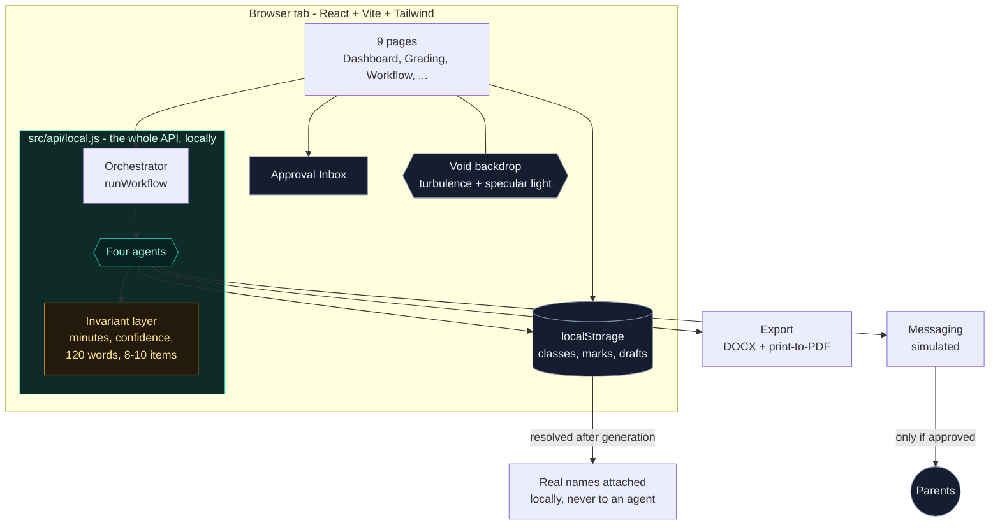

```markdown
<div align="center">

# 🎓 TeacherCopilot

### *An agentic AI teaching assistant that takes the admin off a teacher's plate.*

**Built for school teachers (SDG 4: Quality Education) | Classes 6-12 | English + Hindi**

[](https://jyotitiwari250657.github.io/Teacher-Copilot/)
[](https://github.com/jyotitiwari250657/Teacher-Copilot)


</div>

---

A teacher opens one page, presses **Run Weekly Workflow**, and four specialised AI agents plan the lesson, build three levels of differentiated material, grade every script, regroup the class from the real marks, and draft a message for every family. The teacher reviews and approves everything. 

> **🛡️ Nothing is ever sent to a parent without a click.**

> **🌐 The whole app runs in your browser.** There is no backend server, no database, no API key, and no Python required for the UI. Clone it, run one command, and it works offline. Your student data never leaves the machine.

---

## 📑 Table of Contents

1. [What it does](#-what-it-does)
2. [Architecture](#-architecture)
3. [Quick Start](#-quick-start)
4. [Why there is no backend](#-why-there-is-no-backend)
5. [The 3-Minute Demo](#-the-3-minute-demo)
6. [Agent Behaviors](#-agent-behaviors)
7. [Safety & Privacy](#-safety--privacy)
8. [The In-Browser API](#-the-in-browser-api)
9. [Project Layout](#-project-layout)
10. [Testing](#-testing)
11. [Limitations](#-limitations)
12. [Future Scope](#-future-scope)
13. [Contributing](#-contributing)
14. [License](#-license)

---

## 🌟 What it does

TeacherCopilot automates the heavy lifting of classroom administration through a suite of specialist AI agents:

| Agent | What it does | Output |
| :--- | :--- | :--- |
| 📅 **Lesson Planner** | Turns a topic into a timed lesson. | Objectives, minute-by-minute flow, assessment rubric, exit tickets. |
| 📝 **Grader** | Marks a paper against the answer key. | Marks + confidence per answer, feedback, class analysis. |
| ✂️ **Differentiation** | Rewrites one lesson at three levels. | Support / Core / Extension materials, worksheets, answer keys, student groupings. |
| ✉️ **Parent Update** | Writes a short note to one family. | 120-word-or-shorter WhatsApp message or email, with an approval gate. |

**The Orchestrator** chains them together: `plan -> differentiate -> grade -> regroup -> parent messages`. If a failure occurs in one step, it is recorded, and the run continues gracefully.

The app features **Nine pages:** Login, Dashboard, Classes & Students, Lesson Planner, Grading, Differentiation, Parent Updates, Workflow Run, and Settings.

---

## 🏗️ Architecture

The application is a fully client-side React app that simulates a complex agentic backend locally.



### Design decisions worth knowing

- **The API is a module, not a server.** `src/api/local.js` exports the same object the old HTTP client exported, with the same method names and response shapes. The pages never learned where the data came from. Swapping in a real HTTP client is a one-line change in `src/api/client.js`.
- **Rules enforced in code, not just in prompts.** "Minutes must sum to the duration", "confidence below 0.6 means needs review", "120 words maximum", "8-10 questions" are enforced by the agent functions themselves. Generation that breaks a rule is corrected, not trusted.
- **Privacy by construction.** Agents receive `S01`-style anonymous references, never names, phones, or emails. Names are re-attached locally *after* the text is produced.
- **The approval gate is enforced in code.** `sendMessages` refuses any message whose status is not `approved`. Editing an approved message revokes the approval; editing a message that was already sent is refused outright.
- **The background is a supplied photograph, not a gradient.** `public/app-bg.jpg` sits behind every authenticated page as a fixed, full-bleed layer. It is blurred 34px and scaled 12% past the viewport, reading as a soft ambient wash instead of a visibly upscaled picture. A near-black scrim holds the surface down and a slow steel sheen keeps the silver alive.
- **The dark theme is an inverted palette, not a second stylesheet.** `tailwind.config.js` inverts every color ramp so low numbers are dark surfaces and high numbers are bright text. Every existing `bg-ink-50` / `text-ink-800` class means the right thing on a dark surface.
- **Contrast is verified, not assumed.** Silver on black has far less headroom, so the browser suite walks every visible text node on every page, composites the real background through translucent ancestors, and fails on anything under WCAG AA.
- **The logo is drawn, not borrowed.** `src/components/brand.jsx` is a small set of inline SVGs - an open ring with a node in the gap for the mark - so nothing on screen is a generic stock symbol.

---

## 🚀 Quick Start

### Prerequisites

- **Node.js 18+** - [Download Here](https://nodejs.org)

*(That's it. No Python, no Docker, no database, no API key.)*

### One Command

Clone the repository and run the appropriate startup script for your OS:

**macOS / Linux:**
```bash
git clone https://github.com/jyotitiwari250657/Teacher-Copilot.git
cd Teacher-Copilot
./run.sh
```

**Windows:**
```bat
git clone https://github.com/jyotitiwari250657/Teacher-Copilot.git
cd Teacher-Copilot
run.bat
```

Then open **<http://127.0.0.1:5173>** and log in:
> **Email:** `demo@teachercopilot.app`  
> **Password:** `demo1234`

<details>
<summary>Running it manually</summary>

```bash
cd frontend
npm install
npm run dev
```
</details>

<details>
<summary>Production build</summary>

```bash
./run.sh build          # or: run.bat build
cd frontend && npx vite preview
```
The build is a folder of static files - host it anywhere (e.g., GitHub Pages).
</details>

---

## 🤔 Why there is no backend

The `backend/` directory contains a fully-fledged FastAPI reference implementation. However, **the app runs entirely in the browser.** 

`src/api/local.js` owns the state, persists it to `localStorage`, and runs the exact same four agents the FastAPI backend would. It deliberately mirrors the backend's response shapes (including `problems` validation errors and 401s) so every page works unchanged. The `backend/` folder remains in the repo as an architectural reference, and its 162 `pytest` tests still pass, proving that the browser store perfectly reproduces the REST API logic.

---

## ⏱️ The 3-Minute Demo

The app opens seeded with **Class 8-B (Science), 12 students, a 10-question Photosynthesis paper, and 12 filled-in answer scripts.** You can do the whole demo without typing anything.

- **0:00 - Log in.** `demo@teachercopilot.app` / `demo1234`. You land on the Dashboard.
- **0:15 - Press the big button.** Go to **Workflow Run** and click **Run weekly workflow**. Watch the timeline: five steps fire in order, each showing its agent, its duration, and a live status.
- **0:45 - Open the Approval Inbox.** Below the timeline, one card per output: the lesson plan, the differentiated material, 12 grade results, 12 parent messages. Notice the badges - messages flagged for low marks or attendance are highlighted in red.
- **1:15 - Grading.** Go to **Grading**. One card per student with the AI's marks. Expand a red card - those are the answers the grader marked as low confidence. Click a mark, type a different one, and it becomes *your* mark, not the AI's. Hit **Approve**.
- **2:00 - Differentiation.** Go to **Differentiation** and press **Generate three levels.** Three columns - Support, Core, Extension - all teaching the same objective. Underneath, the suggested student groupings. Download any worksheet as Word, or as a PDF through the browser's print dialog.
- **2:30 - Parent updates.** Go to **Parent Updates**. Twelve short WhatsApp messages, one per family, each about *that* student only. Try sending without approving first - nothing goes out. Approve one, send it, and the status becomes `simulated_sent`.
- **3:00 - Dashboard.** Back on the Dashboard, the time-saved chart has jumped, and the class overview reflects the grading run. **Done.**

*💡 Optional: set the language to **Hindi** on any page and generate again - every agent, including the parent messages, produces Devanagari output.*

---

## 🧠 Agent Behaviors

### 📅 Lesson Planner
- The requested duration is split across phases using a **largest-remainder allocation** with a per-phase floor. A 40-minute lesson is always exactly 40 minutes.
- Short periods drop the lowest-weighted phases rather than producing zero-minute ones.
- Always produces exactly 3 exit tickets and an assessment rubric.
- Honours teacher-supplied objectives instead of inventing new ones.

### 📝 Grader
- **MCQ and true/false: exact match** against the answer key (case- and whitespace-tolerant; lettered options `B` and `b` match; `yes` matches a key of `True`).
- **Numeric:** small floating-point tolerance.
- **Subjective:** keyword-coverage partial credit, never more than the maximum.
- **A blank answer is a certainty, not a guess** - zero marks at full confidence, so an unanswered paper is never dumped on the review queue.
- **Any answer with confidence below 0.6 sets `needs_teacher_review = true`.**
- Teacher overrides are stored separately and always win; the original marks are kept.

### ✂️ Differentiation
- Three levels - **Support** (under 40%), **Core** (40-75%), **Extension** (over 75%) - assigned from real marked work, or forced by the teacher.
- **All three levels share one learning objective**, so the teacher is not teaching three different lessons.
- Each level explains itself in **one line ("what changed")**.
- Each worksheet has **8-10 questions** with a matching answer key.

### ✉️ Parent Update
- **Hard 120-word cap** on WhatsApp bodies, enforced after generation.
- Exactly one **positive**, one **thing to work on**, and one **step for home**.
- A sanitiser strips diagnostic language (*"slow learner"*, *"dyslexic"*), comparative statements (*"other students are doing better"*) and other students' data.
- Low scores (under 35%) and low attendance (under 70%) automatically **flag the message for review** before it can be approved.
- Delivery is **simulated**: sending writes a status and a timestamp, nothing leaves the tab.

---

## 🛡️ Safety & Privacy

| Guarantee | How it is enforced |
| :--- | :--- |
| **No real student data reaches an agent** | Agents receive `S01`-`S12` references. Names are mapped back afterwards, in the store layer. |
| **No parent message is sent without approval** | `sendMessages` skips anything that is not `approved`. Editing an approved message revokes approval; editing a sent message is refused. |
| **Nothing is final until approved** | Lesson plans, grade results and messages all start as drafts. Approval is recorded with a timestamp. |
| **No diagnostic language about children** | A regex list is stripped from every generated message. |
| **No comparisons between students** | Comparative clauses referencing other children are removed. |
| **Child data stays local** | `localStorage` in the teacher's browser. No network request is made at all. |
| **Input validation** | Every write path checks its inputs and throws a readable message, not a traceback. |

---

## 🔌 The In-Browser API

`src/api/local.js` exposes one object, `api`, with the same method names a REST client would have:

| Area | Methods |
| :--- | :--- |
| **Session** | `login`, `me`, `updateMe`, `config` |
| **Classes & students** | `classes`, `createClass`, `updateClass`, `deleteClass`, `students`, `createStudent`, `updateStudent`, `deleteStudent`, `importStudents`, `studentCsvTemplate` |
| **Lessons** | `generateLesson`, `lessons`, `lesson`, `updateLesson`, `approveLesson`, `regenerateLesson` |
| **Grading** | `assessments`, `assessment`, `createAssessment`, `gradeOne`, `gradeBulk`, `gradeBulkCsv`, `results`, `overrideMarks`, `approveResult`, `approveAllResults`, `analysis` |
| **Differentiation** | `differentiate`, `materials`, `material` |
| **Parent updates** | `generateMessages`, `messages`, `updateMessage`, `approveMessage`, `approveAllMessages`, `sendMessages`, `approvalInbox` |
| **Workflow & dashboard** | `runWorkflow`, `workflowStatus`, `workflowRuns`, `workflowInbox`, `rerunStep`, `stepDefinitions`, `dashboard` |

**Exports** are dependency-free: `src/lib/exportDoc.js` renders the plan or worksheet as printable HTML. `docx` saves a Word-compatible `.doc`; `pdf` opens a print-ready window and lets the browser's own "Save as PDF" produce the file. Devanagari survives both paths.

---

## 📂 Project Layout

```text
Teacher-Copilot/
├── run.sh / run.bat                 # One-command start (frontend only)
├── README.md
├── .gitignore
│
├── backend/                         # 🐍 FastAPI reference implementation (optional)
│   ├── app/
│   │   ├── agents/                  # Python AI agent logic
│   │   ├── models.py                # SQLModel DB schemas
│   │   ├── orchestrator.py          # Workflow pipeline
│   │   └── main.py                  # FastAPI entry point
│   └── tests/                       # 162 pytest tests
│
└── frontend/                        # ⚛️ Active React Application
    ├── index.html
    ├── vite.config.js               # No dev proxy - there is nothing to proxy to
    ├── tailwind.config.js           # Dark palette, glass shadows, reveal animation
    ├── verify-standalone.mjs        # 69 logic checks, runs in plain Node
    ├── verify-browser.mjs           # 72 checks in headless Edge over CDP
    └── src/
        ├── main.jsx
        ├── index.css                # Component layer, dark glass surfaces, void pulse
        ├── api/
        │   ├── client.js            # Public API surface + documentFor()
        │   └── local.js             # The entire backend, simulated locally
        ├── data/
        │   ├── seed.js              # Class, students, paper, answer scripts
        │   └── agents.js            # The four agents and the invariant layer
        ├── lib/
        │   └── exportDoc.js         # Word + print-to-PDF, no dependencies
        ├── components/              # brand.jsx, Layout.jsx, ui.jsx, Toast.jsx
        ├── context/                 # AuthContext.jsx
        └── pages/                   # Login, Dashboard, Classes, LessonPlanner, etc.
```

---

## 🧪 Testing

Two suites, neither of which needs a server.

### 1. Standalone Logic Checks
Runs the agents and the local store against stubbed storage:
```bash
cd frontend
node verify-standalone.mjs
```
*Verifies: Lesson-plan minutes rule, exact MCQ matching, blank answers scoring zeros, the 120-word cap, unauthenticated access refusal, and the approval gate.*

### 2. Browser UI Checks
Drives a **built** bundle via `vite preview`, not the dev server, so it tests the artifact you would actually ship.
```bash
npm run build
npx vite preview --port 4173  # serve the real production build
node verify-browser.mjs       # 72 checks in headless Edge over CDP
```
*Verifies: Login page styling, the real credential path, all nine routes loading, the workflow running end-to-end, the void backdrop rendering, zero console errors, and WCAG AA contrast for all 639 visible text nodes.*

---

## ⚠️ Limitations

Known and deliberate for an MVP:
1. **Generation is rule-based.** The agents produce structured, rule-correct output rather than open-ended model text.
2. **Grading is heuristic.** MCQ matching is exact and reliable; subjective marking is keyword-based, not semantic. Low-confidence answers are flagged for you.
3. **Messaging is simulated.** Sending writes a `simulated_sent` status and a timestamp. No real message ever leaves the machine.
4. **Data lives in one browser.** `localStorage` is per-device: no sync, no multi-device access, and clearing site data clears the classroom record.
5. **Single teacher.** No school-level accounts, roles, or multi-teacher isolation.
6. **English and Hindi only.** Other Indian languages are a straightforward extension but are not wired up.
7. **Regenerate discards edits.** Regenerating a lesson plan replaces the content you saved.
8. **PDF export uses the print dialog.** There is no bundled renderer, so a "Save as PDF" step is required.

---

## 🚀 Future Scope

- **Attach a real model.** `src/data/agents.js` is the seam: keep the rules, privacy boundary, and approval gate, and swap the generation body for a hosted LLM call.
- **OCR for handwritten answer sheets.** Photograph a stack of scripts and feed them straight into the Grader.
- **Persistent export/import.** Encrypted backups so a teacher can move a class between devices.
- **Voice input.** Teachers speak a lesson objective in Hindi or English and the planner drafts from the transcript.
- **LMS integration.** Pull rosters and push marks into Google Classroom, Moodle, or Microsoft Teams.
- **Multi-language expansion.** Tamil, Telugu, Bengali, Marathi, and Kannada.
- **Real WhatsApp Business API.** Delivery receipts and template approval via the Meta Cloud API.
- **Rubric-based grading.** Teacher-defined rubrics instead of keyword heuristics.

---

## 🤝 Contributing

Contributions are welcome! If you'd like to improve the UI, add a new language, or wire up a real LLM:

1. Fork the repository.
2. Create your feature branch (`git checkout -b feature/AmazingFeature`).
3. Commit your changes (`git commit -m 'Add some AmazingFeature'`).
4. Push to the branch (`git push origin feature/AmazingFeature`).
5. Open a Pull Request.

---

## 📜 License

Distributed under the MIT License. Built as a demonstration MVP.

<div align="center">
  
**If you find this project useful, please consider giving it a ⭐ on GitHub!**

[](https://github.com/jyotitiwari250657/Teacher-Copilot/stargazers/)

</div>
```
