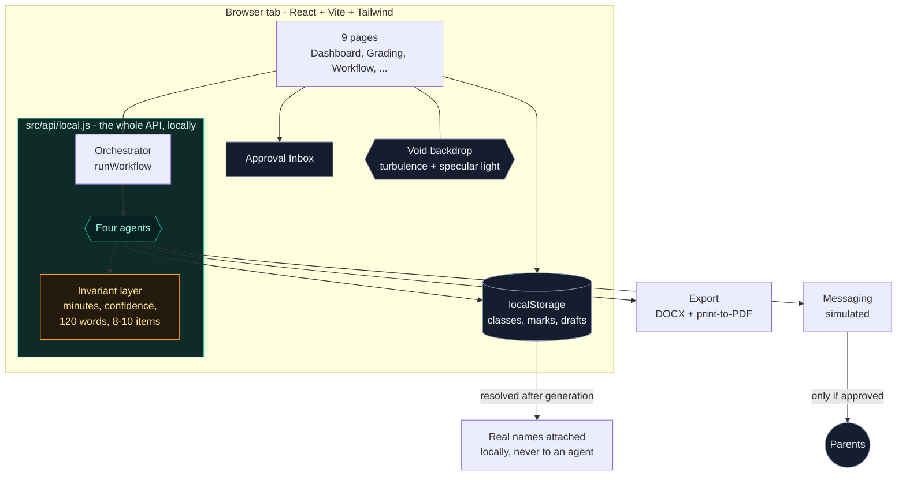

# TeacherCopilot

> 🌐 **Live Web Application**: [https://jyotitiwari250657.github.io/Teacher-Copilot/](https://jyotitiwari250657.github.io/Teacher-Copilot/)  
> 💻 **GitHub Repository**: [https://github.com/jyotitiwari250657/Teacher-Copilot](https://github.com/jyotitiwari250657/Teacher-Copilot)

**An agentic AI teaching assistant that takes the admin off a teacher's plate.**
Built for school teachers (SDG 4: Quality Education), Classes 6-12, English + Hindi.

A teacher opens one page, presses **Run Weekly Workflow**, and four specialised AI agents
plan the lesson, build three levels of differentiated material, grade every script, regroup
the class from the real marks, and draft a message for every family. The teacher reviews
and approves everything. **Nothing is ever sent to a parent without a click.**

> **The whole app runs in your browser.** There is no backend server, no database, no API key
> and no Python. Clone it, run one command, and it works offline. Your student data never
> leaves the machine.

---

## Table of contents

1. [What it does](#1-what-it-does)
2. [Architecture](#2-architecture)
3. [Quick start](#3-quick-start)
4. [Why there is no backend](#4-why-there-is-no-backend)
5. [The 3-minute demo](#5-the-3-minute-demo)
6. [How each agent behaves](#6-how-each-agent-behaves)
7. [Safety and privacy](#7-safety-and-privacy)
8. [The in-browser API](#8-the-in-browser-api)
9. [Project layout](#9-project-layout)
10. [Tests](#10-tests)
11. [Limitations](#11-limitations)
12. [Future scope](#12-future-scope)

---

## 1. What it does

| Agent | Does | Output |
|---|---|---|
| **Lesson Planner** | Turns a topic into a timed lesson | Objectives, minute-by-minute flow, assessment rubric, exit tickets |
| **Grader** | Marks a paper against the answer key | Marks + confidence per answer, feedback, class analysis |
| **Differentiation** | Rewrites one lesson at three levels | Support / Core / Extension materials, worksheets, answer keys, student groupings |
| **Parent Update** | Writes a short note to one family | 120-word-or-shorter WhatsApp message or email, with an approval gate |

The **Orchestrator** chains them: `plan -> differentiate -> grade -> regroup -> parent messages`.
A failure in one step is recorded and the run continues.

**Nine pages:** Login - Dashboard - Classes & Students - Lesson Planner - Grading -
Differentiation - Parent Updates - Workflow Run - Settings.

---

## 2. Architecture



### Design decisions worth knowing

- **The API is a module, not a server.** `src/api/local.js` exports the same object the old
  HTTP client exported, with the same method names and the same response shapes. The pages
  never learned where the data came from. Swapping in a real HTTP client is a one-line change
  in `src/api/client.js`.
- **Rules enforced in code, not just in prompts.** "Minutes must sum to the duration",
  "confidence below 0.6 means needs review", "120 words maximum", "8-10 questions" are
  enforced by the agent functions themselves. Generation that breaks a rule is corrected,
  not trusted.
- **Privacy by construction.** Agents receive `S01`-style anonymous references, never names,
  phones or emails. Names are re-attached locally *after* the text is produced.
- **The approval gate is enforced in code.** `sendMessages` refuses any message whose status
  is not `approved`. Editing an approved message revokes the approval; editing a message that
  was already sent is refused outright.
- **The background is a supplied photograph, not a gradient.** `public/app-bg.jpg` sits behind
  every authenticated page as a fixed, full-bleed layer. The source is only 626x358, so it is
  blurred 34px and scaled 12% past the viewport - it reads as a soft ambient wash instead of a
  visibly upscaled picture. A near-black scrim holds the surface down and a slow steel sheen
  keeps the silver alive. The **login page is deliberately excluded** and keeps its own
  botanical glass composition. The image is measured, not guessed: average `#090909`,
  luminance 0.036, saturation 0.0 - a near-black grayscale, which is why the black + steel
  silver palette fits it.
- **The dark theme is an inverted palette, not a second stylesheet.** `tailwind.config.js`
  inverts every colour ramp so low numbers are dark surfaces and high numbers are bright
  text. Every existing `bg-ink-50` / `text-ink-800` class therefore means the right thing on
  a dark surface, which is why the retheme touched almost no component markup.
  The palette is **black and steel silver**: surfaces run `#060709` to gunmetal with a cool
  blue undertone, `brand` is polished steel, and status colours are desaturated ~45% so amber,
  red and green read as signals rather than competing with the monochrome.
  Because the ramp is inverted, *text on a bright silver surface uses `text-ink-50`, never
  `text-ink-900`* - `ink-900` is white, and white on steel fails contrast.
- **Contrast is verified, not assumed.** Silver on black has far less headroom than the
  previous teal, so the browser suite walks every visible text node on every page, composites
  the real background through translucent ancestors, and fails on anything under WCAG AA.
- **The logo is drawn, not borrowed.** `src/components/brand.jsx` is a small set of inline
  SVGs - an open ring with a node in the gap for the mark, a node graph for the "an agent did
  this" affordance - so nothing on screen is a generic stock symbol. The favicon is the same
  glyph inlined as a data URI, so the browser never requests a missing file.
- **One glow, themed per button.** A single set of rules drives every action button, and each
  variant supplies only its own `--glow` colour. One place to tune the motion; no per-button
  duplication.

---

## 3. Quick start

### Prerequisites

- **Node.js 18+** - <https://nodejs.org>

That's it. No Python, no Docker, no database, no API key.

### One command

```bash
git clone <this repo> && cd teachercopilot
./run.sh          # macOS / Linux
```

```bat
run.bat           :: Windows
```

Then open **<http://127.0.0.1:5173>** and log in:

```
demo@teachercopilot.app
demo1234
```

<details>
<summary>Running it manually</summary>

```bash
cd frontend
npm install
npm run dev
```

</details>

<details>
<summary>Production build</summary>

```bash
./run.sh build          # or: run.bat build
cd frontend && npx vite preview
```

The build is a folder of static files - host it anywhere.

</details>

---

## 4. Why there is no backend

The original build had a FastAPI service. Moving it into the browser was worth it for a
classroom tool:

- **Nothing to install.** A teacher, or a demo audience, runs one command.
- **No student data leaves the device.** There is no server to leak, no database to secure,
  and no key to misconfigure.
- **It works on a plane.** No network call is made, so the demo cannot fail because of a
  hotel wifi or a rate limit.
- **It still runs the real rules.** The grading thresholds, the word caps and the approval
  gate are genuine logic, not fixtures.

The agents are deterministic rule engines today, which keeps behaviour identical on every
machine. `src/data/agents.js` is the seam: each function is a pure function of its input,
so swapping the body for a call to a hosted model is a local change that leaves the rules,
the privacy boundary and the approval gate intact.

---

## 5. The 3-minute demo

The app opens seeded with **Class 8-B (Science), 12 students, a 10-question Photosynthesis
paper and 12 filled-in answer scripts.** You can do the whole demo without typing anything.

**0:00 - Log in.** `demo@teachercopilot.app` / `demo1234`. You land on the Dashboard.

**0:15 - Press the big button.** Go to **Workflow Run** and click **Run weekly workflow**.
The topic is already filled in. Watch the timeline: five steps fire in order, each showing
its agent, its duration and a live status.

**0:45 - Open the Approval Inbox.** Below the timeline, one card per output: the lesson plan,
the differentiated material, 12 grade results, 12 parent messages. Notice the badges -
messages flagged for low marks or attendance are highlighted in red.

**1:15 - Grading.** Go to **Grading**. One card per student with the AI's marks. Expand a red
card - those are the answers the grader marked as low confidence. Click a mark, type a
different one, and it becomes *your* mark, not the AI's. Hit **Approve**.

**2:00 - Differentiation.** Go to **Differentiation** and press **Generate three levels.**
Three columns - Support, Core, Extension - all teaching the same objective. Underneath, the
suggested student groupings. Download any worksheet as Word, or as a PDF through the
browser's print dialog.

**2:30 - Parent updates.** Go to **Parent Updates**. Twelve short WhatsApp messages, one per
family, each about *that* student only. Try sending without approving first - nothing goes
out. Approve one, send it, and the status becomes `simulated_sent`.

**3:00 - Dashboard.** Back on the Dashboard, the time-saved chart has jumped, and the class
overview reflects the grading run. **Done.**

Optional one-liner: set the language to **Hindi** on any page and generate again - every
agent, including the parent messages, produces Devanagari output.

---

## 6. How each agent behaves

### Lesson Planner

- The requested duration is split across phases using a **largest-remainder allocation**
  with a per-phase floor. A 40-minute lesson is always exactly 40 minutes, and so is every
  total from 5 to 200.
- Short periods drop the lowest-weighted phases rather than producing zero-minute ones.
- Always produces exactly 3 exit tickets and an assessment rubric.
- Honours teacher-supplied objectives instead of inventing new ones.

### Grader

- **MCQ and true/false: exact match** against the answer key (case- and whitespace-tolerant;
  lettered options `B` and `b` match; `yes` matches a key of `True`).
- **Numeric:** small floating-point tolerance.
- **Subjective:** keyword-coverage partial credit, never more than the maximum.
- `strictness` (lenient / standard / strict) scales partial credit.
- **A blank answer is a certainty, not a guess** - zero marks at full confidence, so an
  unanswered paper is never dumped on the review queue.
- **Any answer with confidence below 0.6 sets `needs_teacher_review = true`.**
- Teacher overrides are stored separately and always win; the original marks are kept.
- Supports bulk grading from a list or from an uploaded CSV.

### Differentiation

- Three levels - **Support** (under 40%), **Core** (40-75%), **Extension** (over 75%) -
  assigned from real marked work, or forced by the teacher.
- **All three levels share one learning objective**, so the teacher is not teaching three
  different lessons.
- Each level explains itself in **one line ("what changed")**.
- Each worksheet has **8-10 questions** with a matching answer key.

### Parent Update

- **Hard 120-word cap** on WhatsApp bodies, enforced after generation.
- Exactly one **positive**, one **thing to work on**, and one **step for home**.
- A sanitiser strips diagnostic language (*"slow learner"*, *"dyslexic"*), comparative
  statements (*"other students are doing better"*) and other students' data.
- Low scores (under 35%) and low attendance (under 70%) automatically **flag the message for
  review** before it can be approved.
- Targets are `{{student_name}}` placeholders, substituted locally so the agent never sees
  the real name.
- Delivery is **simulated**: sending writes a status and a timestamp, nothing leaves the tab.

---

## 7. Safety and privacy

| Guarantee | How it is enforced |
|---|---|
| **No real student data reaches an agent** | Agents receive `S01`-`S12` references. Names are mapped back afterwards, in the store layer. |
| **No parent message is sent without approval** | `sendMessages` skips anything that is not `approved`. Editing an approved message revokes approval; editing a sent message is refused. |
| **Nothing is final until approved** | Lesson plans, grade results and messages all start as drafts. Approval is recorded with a timestamp. |
| **No diagnostic language about children** | A regex list is stripped from every generated message. |
| **No comparisons between students** | Comparative clauses referencing other children are removed. |
| **Child data stays local** | `localStorage` in the teacher's browser. No network request is made at all. |
| **Input validation** | Every write path checks its inputs and throws a readable message, not a traceback. |

---

## 8. The in-browser API

`src/api/local.js` exposes one object, `api`, with the same method names a REST client
would have. These are the methods the pages use:

| Area | Methods |
|---|---|
| Session | `login`, `me`, `updateMe`, `config` |
| Classes & students | `classes`, `createClass`, `updateClass`, `deleteClass`, `students`, `createStudent`, `updateStudent`, `deleteStudent`, `importStudents`, `studentCsvTemplate` |
| Lessons | `generateLesson`, `lessons`, `lesson`, `updateLesson`, `approveLesson`, `regenerateLesson` |
| Grading | `assessments`, `assessment`, `createAssessment`, `gradeOne`, `gradeBulk`, `gradeBulkCsv`, `results`, `overrideMarks`, `approveResult`, `approveAllResults`, `analysis` |
| Differentiation | `differentiate`, `materials`, `material` |
| Parent updates | `generateMessages`, `messages`, `updateMessage`, `approveMessage`, `approveAllMessages`, `sendMessages`, `approvalInbox` |
| Workflow & dashboard | `runWorkflow`, `workflowStatus`, `workflowRuns`, `workflowInbox`, `rerunStep`, `stepDefinitions`, `dashboard` |

Every method is `async` and returns the shape the UI already expects. Failures throw an
`ApiError` carrying a `status` and a readable `message`.

**Exports** are dependency-free: `src/lib/exportDoc.js` renders the plan or worksheet as
printable HTML. `docx` saves a Word-compatible `.doc`; `pdf` opens a print-ready window and
lets the browser's own "Save as PDF" produce the file. No headless renderer, no font
embedding, and Devanagari survives both paths.

---

## 9. Project layout

```
teachercopilot/
├── run.sh / run.bat                 one-command start (frontend only)
├── README.md
├── .gitignore
└── frontend/
    ├── index.html
    ├── vite.config.js               no dev proxy - there is nothing to proxy to
    ├── tailwind.config.js           dark palette, glass shadows, reveal animation
    ├── verify-standalone.mjs        69 logic checks, runs in plain Node
    ├── verify-browser.mjs           72 checks in headless Edge over CDP
    └── src/
        ├── main.jsx
        ├── index.css                component layer, dark glass surfaces, .tc-login,
        │                            .void-pulse and the shared .glow-btn rules
        ├── api/
        │   ├── client.js            the public API surface + documentFor()
        │   └── local.js             the entire backend, in the browser
        ├── data/
        │   ├── seed.js              class, students, paper, answer scripts
        │   └── agents.js            the four agents and the invariant layer
        ├── lib/exportDoc.js         Word + print-to-PDF, no dependencies
        ├── components/
        │   ├── brand.jsx            inline SVG mark, wordmark, agent glyph, void backdrop
        │   ├── Layout.jsx
        │   ├── ui.jsx
        │   └── Toast.jsx
        ├── context/AuthContext.jsx
        └── pages/                   Login, Dashboard, Classes, LessonPlanner,
                                       Grading, Differentiation, ParentUpdates,
                                       Workflow, Settings
```

> `backend/` is still in the repository as the original reference implementation. It is
> **not required** to run, build or test anything above. Its 162 pytest tests still pass,
> and it is the reference for the REST shapes the browser store reproduces.

---

## 10. Tests

Two suites, neither of which needs a server.

```bash
cd frontend
node verify-standalone.mjs     # 69 checks - agents and the local API
npm run build
npx vite preview --port 4173  # serve the real production build
node verify-browser.mjs        # 72 checks - the real UI in headless Edge
```

> `verify-browser.mjs` drives a **built** bundle via `vite preview`, not the dev
> server, so it tests the artifact you would actually ship. Point it elsewhere with
> `TC_BASE_URL=http://127.0.0.1:5173 node verify-browser.mjs`.

**`verify-standalone.mjs`** runs the agents and the local store against stubbed storage:

- **Lesson-plan minutes rule** - `allocateMinutes` is exact for *every* total from 5 to 200,
  and each generated lesson carries exactly 3 exit tickets.
- **Grader** - exact MCQ matching, case and whitespace tolerance, lettered options, near
  misses (`chloroplast` does not match `chlorophyll`), `yes` matching `True`, blank answers
  scoring certain zeros, marks never exceeding the maximum, and lenient never scoring below
  strict.
- **Differentiation** - 8-10 questions per level, answer keys matching question ids, three
  distinct "what changed" lines, groups following the score bands.
- **Parent updates** - the 120-word cap, the three required parts, low score and low
  attendance both flagged, diagnostic and comparative language stripped, and no student ID
  leaking into the text.
- **The API** - unauthenticated access refused, wrong password rejected, the full five-step
  workflow, overrides winning and persisting, and the approval gate: unapproved sends
  blocked, approved sends succeeding, edits revoking approval, and sent messages refusing
  edits.

**`verify-browser.mjs`** launches headless Edge over the DevTools protocol and checks the
real rendered app:

- **Login page** - every string from the design, the botanical photo at `object-fit: cover`,
  the glass layer's 10px blur, `100dvh` with a `100vh` fallback, `overflow: hidden`, a CTA
  56-68px tall in black with white text and a 3px radius spanning the full form, and
  generous spacing between the email and password fields.
- **Sign-in** - the real credential path, ending in a stored session.
- **Every page** - all nine routes load and render their content with no backend.
- **Differentiation** - generating really produces the three levels and the groupings.
- **The workflow** - runs end to end from the button.
- **The shell** - the void backdrop is fixed and full-bleed, sits behind the
  content, has the turbulence/specular filter actually applied, and its overlay
  animates; every button variant renders its own glow colour and transitions
  `box-shadow` rather than snapping; the logo is an inline SVG and the generic
  sparkle icon is gone.
- **Zero console errors** across the entire run.
- **Contrast** - every visible text node on all eight authenticated pages is measured against
  its real composited background and must clear WCAG AA. 639 nodes checked.

The frontend production build is verified separately with `npm run build`.

---

## 11. Limitations

Known and deliberate for an MVP:

1. **Generation is rule-based.** The agents produce structured, rule-correct output rather
   than open-ended model text. Every invariant holds, but the prose is templated.
2. **Grading is heuristic.** MCQ matching is exact and reliable; subjective marking is
   keyword-based, not semantic. That is exactly why low-confidence answers are flagged for
   you and nothing is final without approval. OCR of handwritten scripts is not implemented.
3. **Messaging is simulated.** Sending writes a `simulated_sent` status and a timestamp. No
   real message ever leaves the machine, because there is nowhere for it to go.
4. **Data lives in one browser.** `localStorage` is per-device and per-browser: no sync, no
   multi-device access, and clearing site data clears the classroom record. Export your data
   if it matters.
5. **Single teacher.** No school-level accounts, roles or multi-teacher isolation.
6. **English and Hindi only.** Other Indian languages are a straightforward extension but are
   not wired up.
7. **Regenerate discards edits.** Regenerating a lesson plan replaces the content you saved.
8. **PDF export uses the print dialog.** There is no bundled renderer, so a "Save as PDF"
   step is required for the PDF format. Word export is a direct download.

---

## 12. Future scope

- **Attach a real model.** `src/data/agents.js` is the seam: keep the rules, the privacy
  boundary and the approval gate, and swap the generation body for a hosted call.
- **OCR for handwritten answer sheets** - photograph a stack of scripts and feed them
  straight into the Grader. This is the single biggest unlock for real classroom use.
- **Persistence that outlives the browser** - encrypted export/import, so a teacher can move
  a class between devices without a server.
- **Voice input** - teachers speak a lesson objective in Hindi or English and the planner
  drafts from the transcript.
- **LMS integration** - pull rosters and push marks into Google Classroom, Moodle or
  Microsoft Teams.
- **Multi-language expansion** - Tamil, Telugu, Bengali, Marathi and Kannada, with
  language-specific grading rubrics and translation of parent updates.
- **Real WhatsApp Business API** via the official Meta Cloud API, with delivery receipts and
  template approval, replacing the simulation behind the same interface.
- **Rubric-based grading** - teacher-defined rubrics instead of keyword heuristics, plus
  question-level analytics that feed back into the next lesson plan.
- **Parent portal** - read-only view of a child's progress and upcoming deadlines.

---

## Licence

MIT. Built as a demonstration MVP.